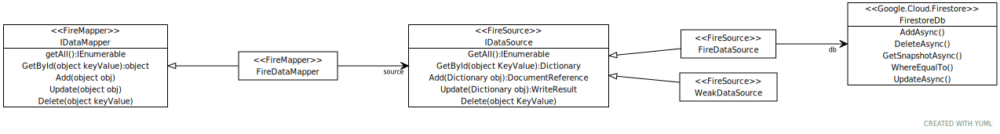

**To Run tests you must place your Firebase key json file in folder `FireSource.Test\Resources`.**

First create your Firestore database following the guide [isel-AVE-2021-FireStore-get-started.md](isel-AVE-2021-FireStore-get-started)

High level view of projects and core types:



Run tests with `dotnet test --logger "console;verbosity=detailed"` to see `Console` output.

List tests with `dotnet test -t`

Select tests to run with `dotnet test --filter NameOfTheClassTest`


Run coverage with:
```
dotnet test --collect:"XPlat Code Coverage"
reportgenerator -reports:Project.Tests\TestResults\66e8839d-6844-4b8a-8067-dc9c32abed5d\coverage.cobertura.xml  -targetdir:coverage
coverage\index.htm
```