FireStore database is a cloud-hosted, NoSQL database that may store JSON
documents. FireStore databases are managed within a FireBase project, thus you
have first to create a Firebase project, following next steps.

At the end you will create a simple Dotnet console application to get your JSON
documents.

1. [https://firebase.google.com/](https://firebase.google.com/)
2. You should be logged in with a google account.
3. Click on “Get started”

4. Click on “Create Project”

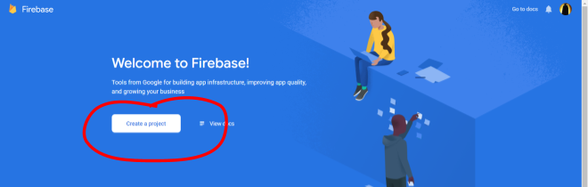

5. Give a name to your project. A unique identifier will be proposed for your
   project (Remember it! You will need it later to access your project).

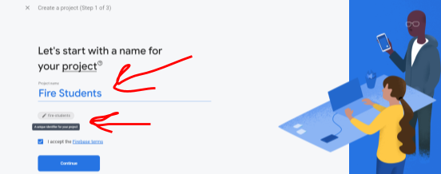

6. Choose whether you want to track with Google analytics or not. It is your
   choice.

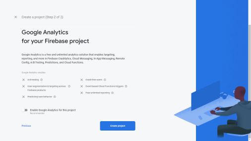

7. Create Project. It will take a while.

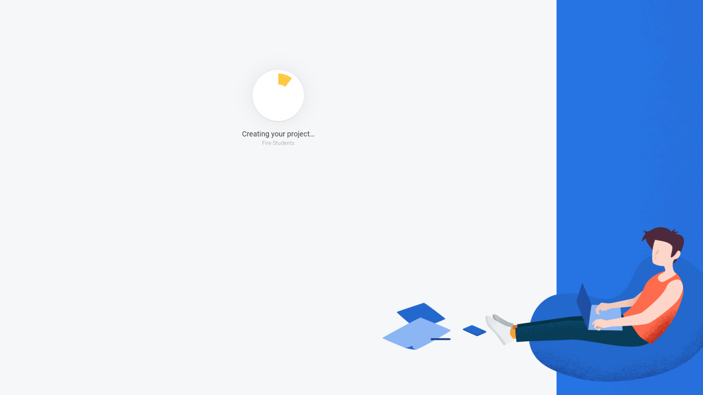

8. Proceed with continue

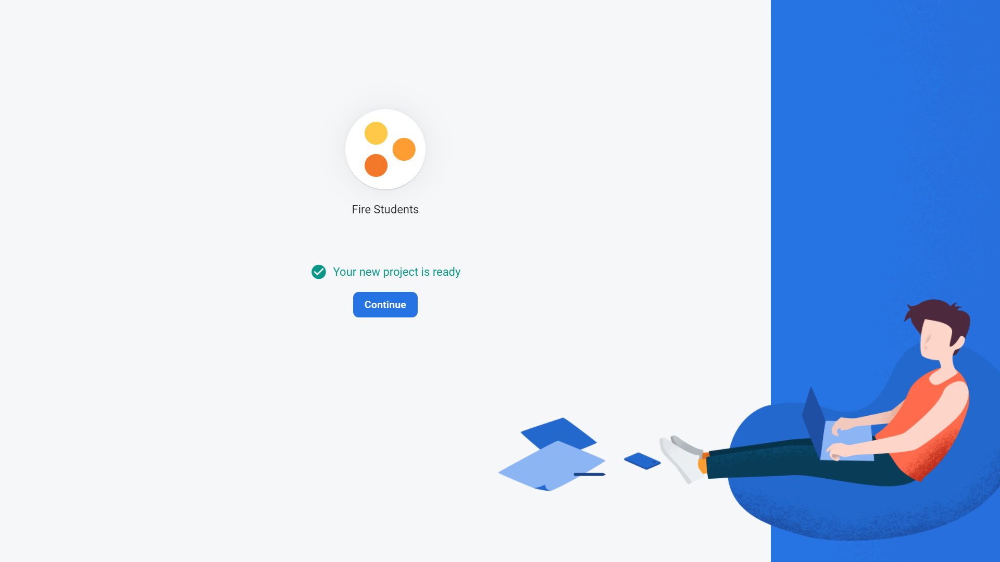

9. Expand the Build menu and select Firestore Database

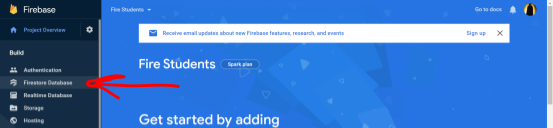

10. Click on “Create Database”

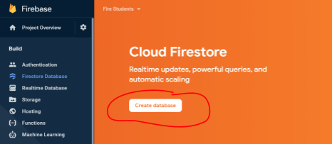

11. Start in production mode

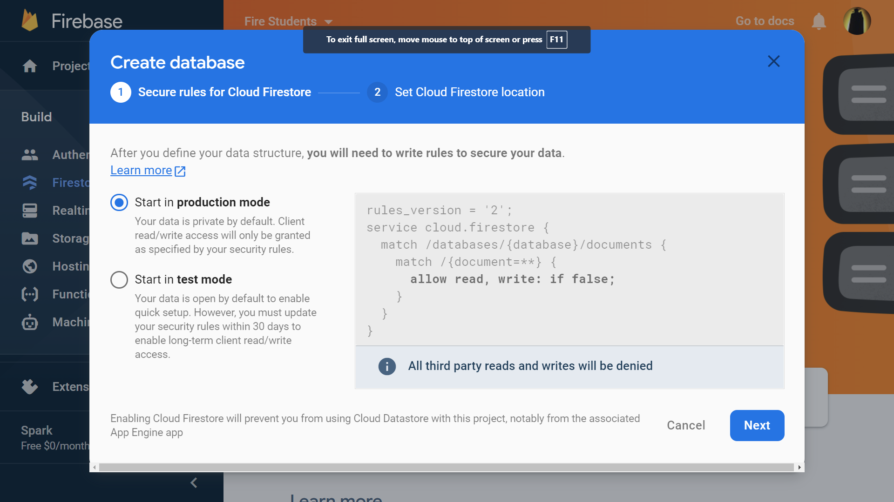

12. Set your location

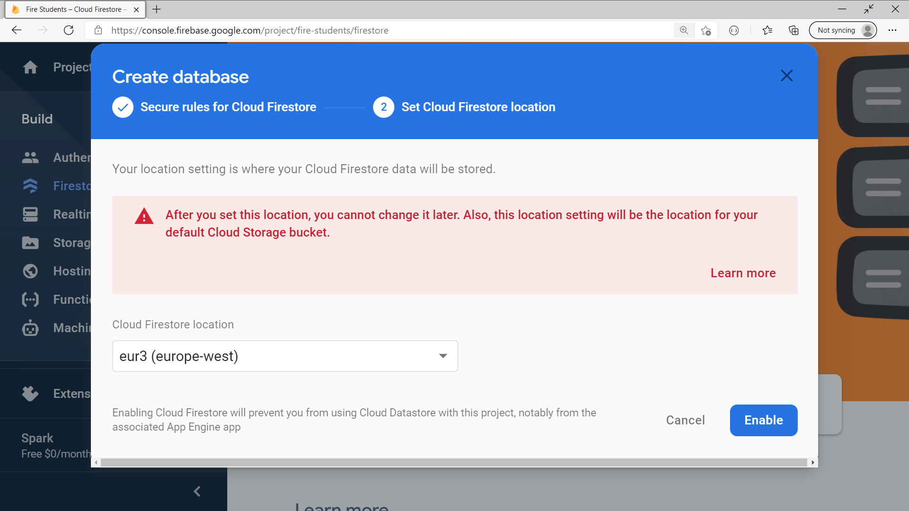

13. Wait …

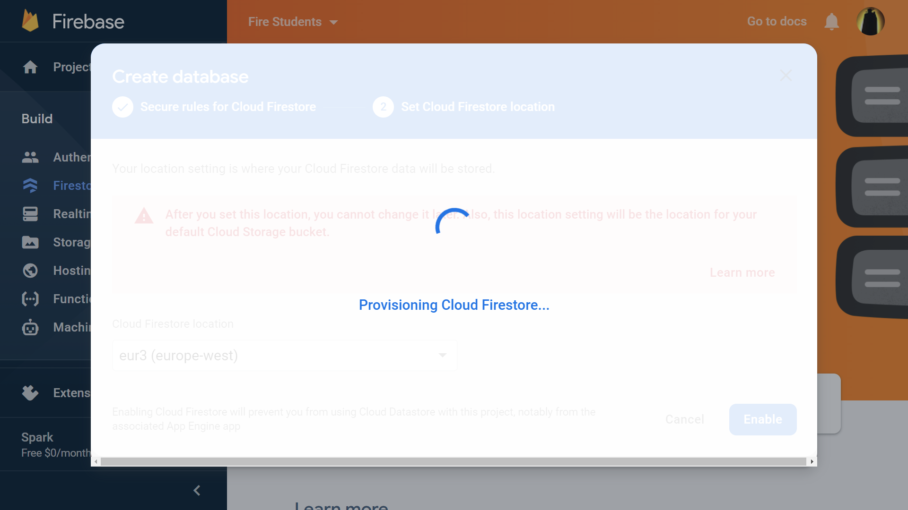

14. Start a new Collection
15. Give the collection ID “students”

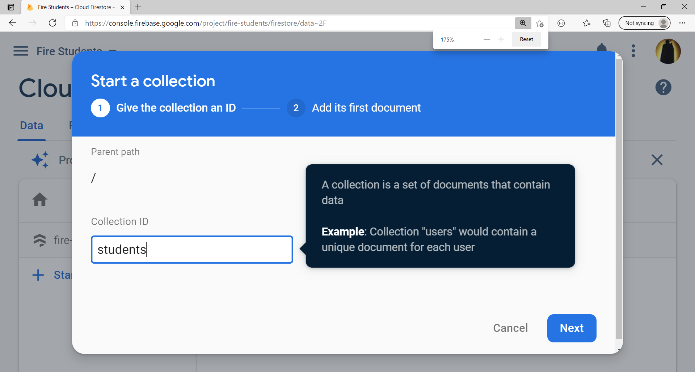

16. Select Auto-ID and add two fields for your first document: name and number

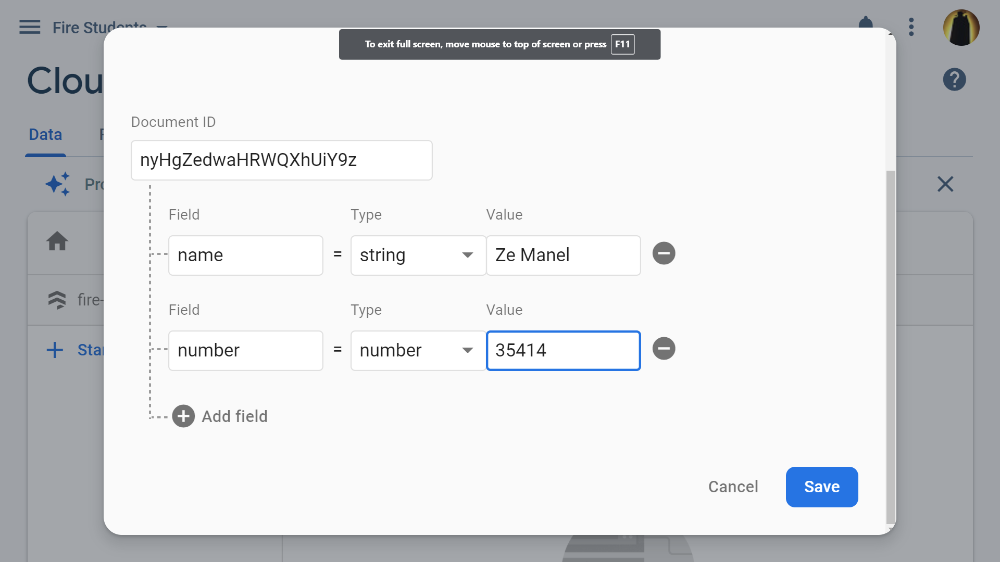

17. Add a couple of more documents with the same structure: name and number.

18. Select Project Settings

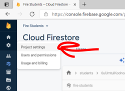

19. Service and Accounts

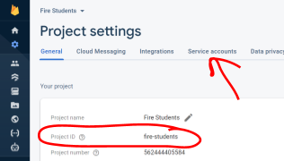

20. Generate a new private key

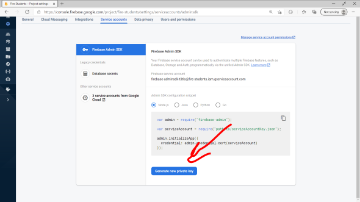

21. Generate Key

22. Download and later copy it to the AppFireStudents project folder.

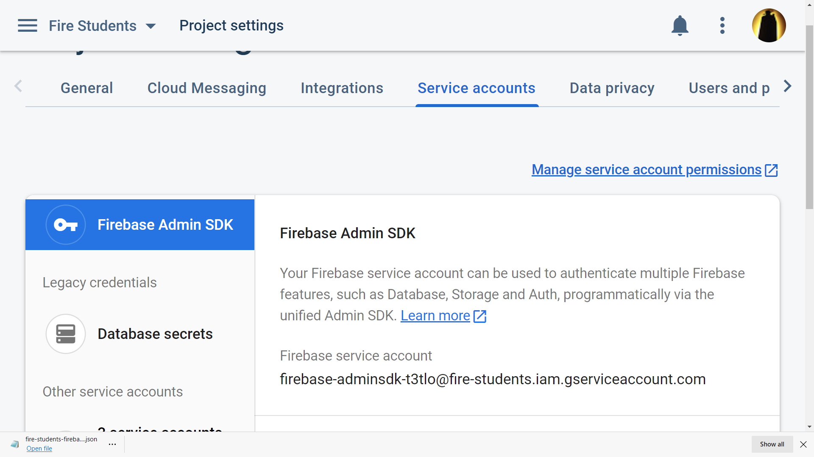

23. Create a dotnet console application to access your fire-students database

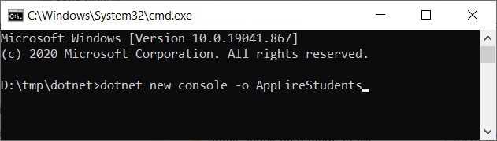

24. cd AppFireStudents
25. Open [https://www.nuget.org/](https://www.nuget.org/)
26. Type on search: google cloud firestore
27. Select Google.Cloud.Firestore by: google-cloud

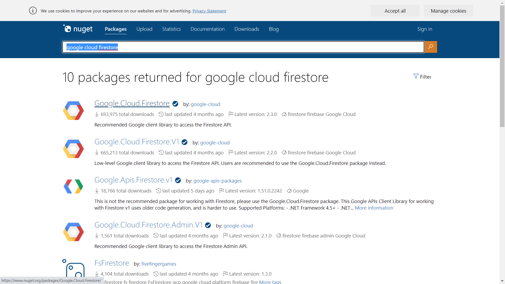

28. Copy .NET CLI command

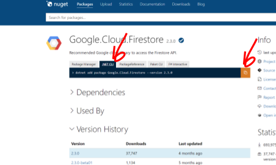

29. Paste

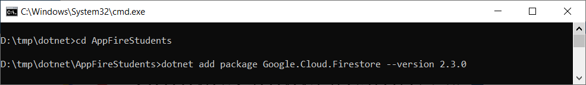

30. Type `cat AppFireStudents.csproj` and you will observe:

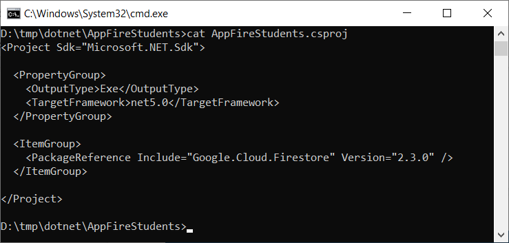

31. Paste here, in the AppFireStudents folder,  the json file downloaded in step
    22.

32. Set an environment variable GOOGLE_APPLICATION_CREDENTIALS with the path to
    the json file, such as (notice in Linux use EXPORT rather than SET):

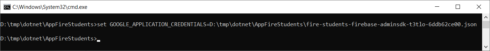

33. Write the following `Program.cs`. **NOTICE that you should use your project ID on line 9 where you find `FirestoreDb.Create("USE here YOUR Project ID");`** (e.g. `fire-students`). On step 19 of this guide you may find your Project ID.

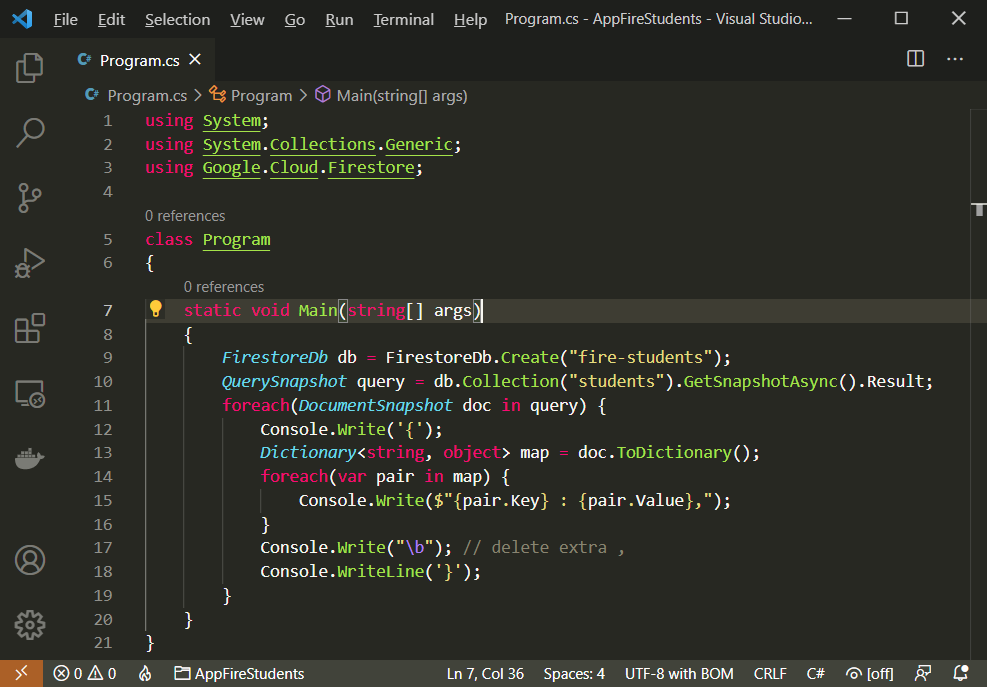

34. dotnet run should produce something like:

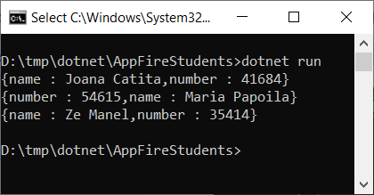